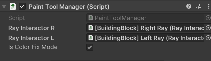
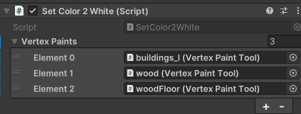
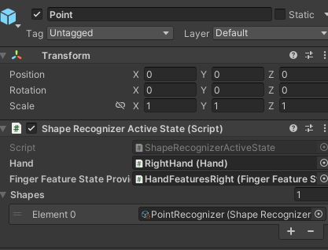

# PaintToolの使い方
PaintTool.prefabをSceneに置いてから、それぞれの子prefabを設定すれば使えます。
SetColor2

## BrushSetting
Brushの色とサイズを決めれます  
play modeで"Apply Settings"を押さないと反映されません。  

## PaintToolManager
- PaintToolManagerにLeftRay、LightRayをアタッチ  
こうすることで、Rayで色塗りできるようになります。  

また、IsColorFixModeをfalseにすると、BrushSettingで指定した色で色塗りできるようになります。
  

## SetColor2White
色をなくしたいオブジェクトを登録すると、Play Mode時に指定したオブジェクトの色がなくなる。

## GestureManager
PointをONにすると、指さすことで色を塗れます。  
PinchInをONにすると、PinchInで色を塗れます。  
どちらもOFFにすると、常に色を塗れます。  
使う前に、HandとFingerFeatureStateProviderを設定してください。

## Tag
色を塗りたいオブジェクトのTagは、Untagged, Yellow, Brown, Greenのどれかにしてください  
Yellow, Brown, Green Tagのオブジェクトは、Cheese, Baguette, Wineに触ったときだけ色塗りできます。